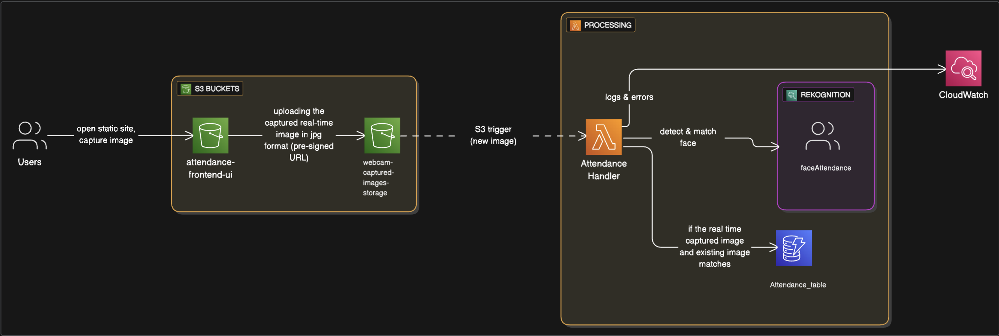

# Real-Time Attendance System using AWS Rekognition

This project demonstrates how key AWS services like Amazon S3, AWS Lambda, Amazon Rekognition, and Amazon DynamoDB can work together to create a real-time, serverless facial recognition attendance system.

The frontend is built using simple HTML, CSS, and JavaScript, allowing users to open a static web page, capture an image via webcam, and upload it directly to an S3 bucket using a pre-signed URL. When a new image is uploaded, a Lambda function is triggered. It invokes Amazon Rekognition to detect and compare the face with stored images in the Rekognition collection.

If a match is found, the user's attendance is recorded in DynamoDB along with a timestamp. CloudWatch logs are also generated for observability and debugging.

This architecture is fully serverless, ensuring scalability, low maintenance, and cost efficiency — ideal for smart classroom or office check-in systems
---

## 🧭 System Architecture

---

## 🧠 Features

- Webcam-based face capture from a web UI
- Real-time face recognition using AWS Rekognition
- Attendance logging with timestamp in DynamoDB
- S3-based image upload + Lambda automation
- Logs monitored via AWS CloudWatch

---

## 🧱 Tech Stack

- **Frontend**: html, css and js (in `/webcamui`)
- **Backend API**: pre-signed url (in `/S3-upload-api`)
- **Image Processing**: AWS Rekognition (triggered via Lambda)
- **Storage**: Amazon S3
- **Database**: DynamoDB

---

## ⚙️ How It Works

1. User opens the frontend (`webcamui`) hosted on S3
2. Captures image via webcam → sent to S3 via pre-signed URL
3. Image upload triggers a Lambda function
4. Lambda invokes Rekognition to compare with stored faces
5. If match found, logs entry in DynamoDB

